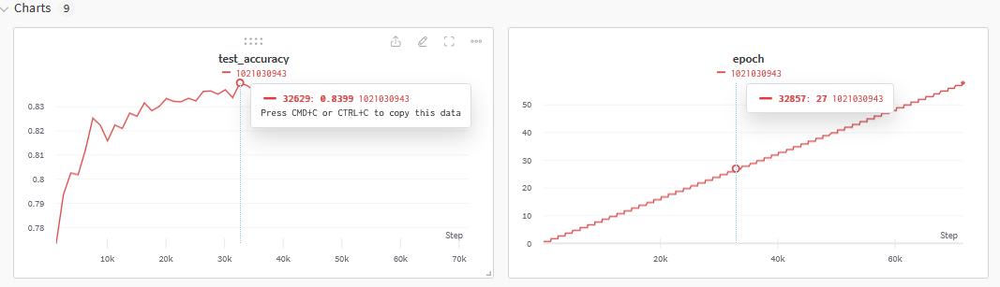
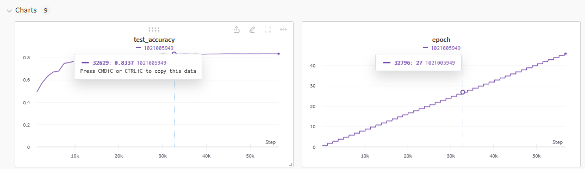
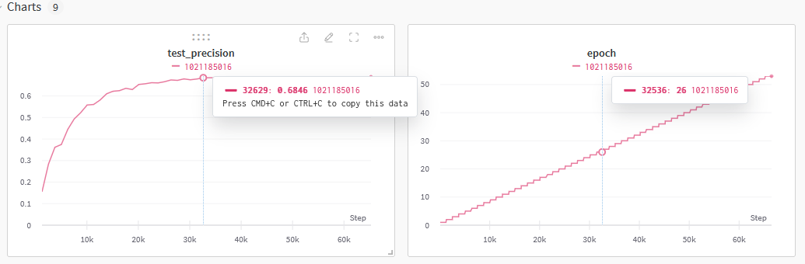
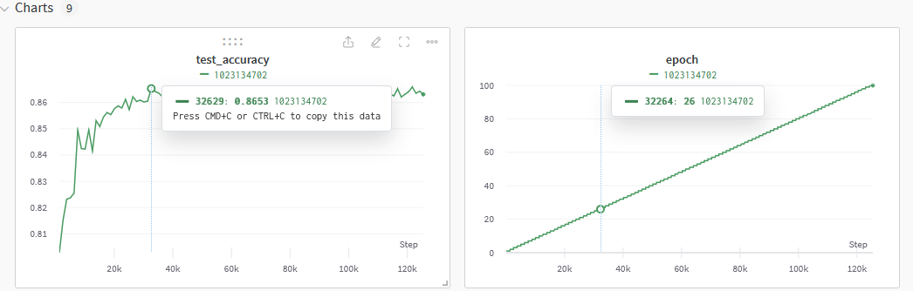
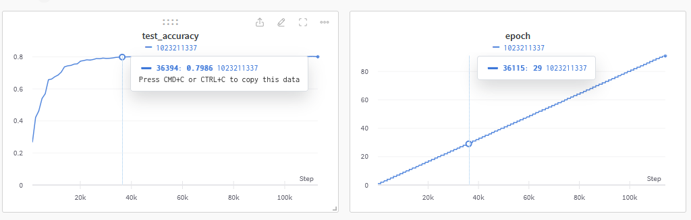
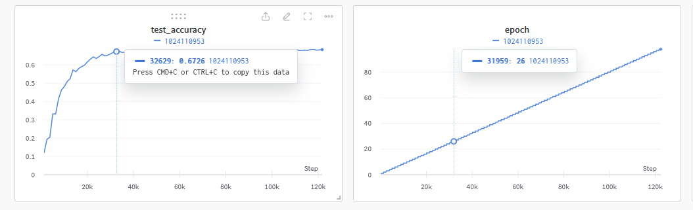

# 快速部署


```
#训练仅需要安装下列第三方包

pandas
scikitlearn
torch  # 按官方的命令安装！！！
tqdm
matplotlib
wandb
```


# 训练分析


## 18-fc层



## 18-全参数



## 18-全框架



## 50-fc层



## 50-全参数



## 50-全框架




# torchcam安装教程

1. 解压torch-cam.zip至根目录下

2. ```
   #命令行执行
   pip install -e ../torch-cam/.
   ```

   